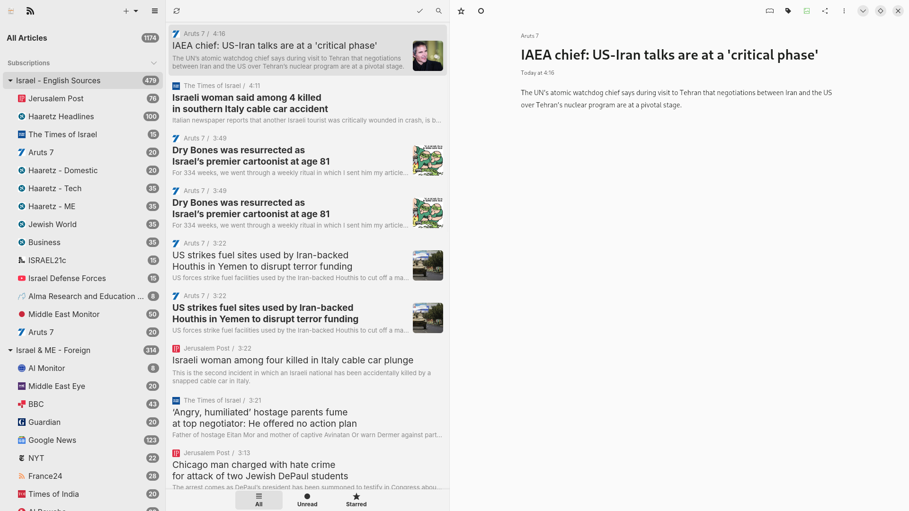

# Israel News RSS Feeds

## Overview

This repository contains a curated collection of RSS feed links for monitoring news about Israel from various sources. The feeds were assembled on April 18, 2025, and are organized into categories to facilitate comprehensive news monitoring of this region.

## Contents

The repository includes an OPML file (`180425/Newsflash.OPML`) that can be imported into any RSS reader supporting the OPML format. The feeds are organized into the following categories:

- **Israel - Hebrew**: News sources in Hebrew (Ynet, The Marker, Maariv)
- **OSINT**: Open Source Intelligence (Bellingcat)
- **World News**: International news sources (Foreign Policy)
- **Multilateral**: News from international organizations (UN News)
- **Israel Gov**: Israeli government sources
- **Jewish World**: News related to Jewish communities (AJ+, JFeed, JNS)
- **Israel - English Sources**: Israeli news in English (Haaretz, Times of Israel, Jerusalem Post)
- **Israel & ME - Foreign**: Foreign news about Israel and Middle East (Guardian, BBC, Al Monitor)
- **NGO & Think Tank**: News from NGOs and think tanks (Middle East Institute, Crisis Group)
- **Academic**: Academic sources (LSE Middle East Centre)
- **Blogs**: Blog sources (Israelycool)

## How to Use

### Importing into an RSS Reader

1. Download the OPML file from this repository
2. Open your RSS reader application
3. Look for an "Import" or "Import OPML" option
4. Select the downloaded OPML file
5. The feeds will be imported with their category structure intact

### Recommended RSS Readers

- [Feedly](https://feedly.com/)
- [Inoreader](https://www.inoreader.com/)
- [NewsBlur](https://newsblur.com/)
- [The Old Reader](https://theoldreader.com/)
- [Feedreader](https://feedreader.com/)
- [NewsFlash](https://gitlab.com/news-flash/news_flash_gtk) (Linux)

 

## License

This collection is provided for public use. The feeds themselves belong to their respective owners.
